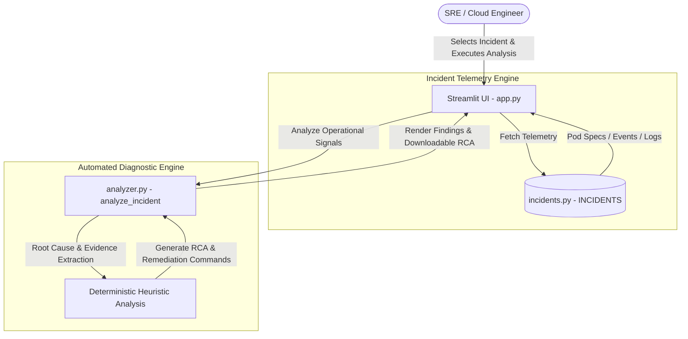

# Anmol AI Ops Incident Investigator

[](https://www.python.org/)
[](https://streamlit.io/)
[](https://azure.microsoft.com/en-us/products/kubernetes-service)
[](LICENSE)

An AI-ready Kubernetes incident investigation platform built by **Anmol**. This public technical portfolio application demonstrates expertise in **Azure**, **AKS**, **Kubernetes**, **SRE**, **DevOps**, **Python**, and **AIOps**.

The application analyzes operational signals (Pod status, Kubernetes events, and container logs), identifies probable root causes, and recommends step-by-step diagnostic and remediation actions alongside SRE-grade Root Cause Analysis (RCA) reports.

---

## 🏛️ Architecture



---

## ✨ Features

- **Simulated AKS Telemetry:** 5 realistic Kubernetes troubleshooting scenarios (`CrashLoopBackOff`, `OOMKilled`, `ImagePullBackOff`, `Readiness Probe Failure`, `PVC Pending`).
- **Automated Root Cause Identification:** Immediate identification of misconfigurations, resource exhaustion, authentication failures, and network dependencies.
- **SRE Diagnostic & Remediation Guidance:** Recommended `kubectl` and `az` CLI commands ready for copy-paste execution.
- **Automated RCA Generation:** Generates comprehensive SRE Root Cause Analysis reports with download capabilities (`.md`).
- **Production Safety First:** 100% safe demonstration environment with no access to live production systems or credentials.

---

## 🖼️ Screenshots

> _Placeholder for application UI screenshots_

| Dashboard Header & Telemetry | Incident Investigation Result & RCA |
|:----------------------------:|:----------------------------------:|
| `` | `` |

---

## 🚀 Installation & Local Execution

### Prerequisites

- Python 3.11+
- Git

### 1. Clone the Repository

```bash
git clone https://github.com/your-username/anmol-aiops-investigator.git
cd anmol-aiops-investigator
```

### 2. Create and Activate Virtual Environment

**Windows:**
```powershell
python -m venv .venv
.venv\Scripts\activate
```

**macOS / Linux:**
```bash
python3 -m venv .venv
source .venv/bin/activate
```

### 3. Install Dependencies

```bash
python -m pip install -r requirements.txt
```

### 4. Run the Streamlit Application

```bash
python -m streamlit run app.py
```

The application will launch automatically in your browser at `http://localhost:8501`.

---

## 🌐 Public Deployment & Shareable Link

### Method 1: Deploy on Streamlit Community Cloud (Recommended - 1 Click & Free)

1. Push your code to a public GitHub repository (`anmol-aiops-investigator`).
2. Go to **[share.streamlit.io](https://share.streamlit.io)** and log in with your GitHub account.
3. Click **"New app"**.
4. Select your repository, branch (`main`), and set Main file path to `app.py`.
5. Click **"Deploy!"**.
6. Streamlit will build your app and generate a public live HTTPS link: `https://anmol-aiops-investigator.streamlit.app`.

### Method 2: Deploy on Render.com (Free Tier)

1. Create a free account at **[render.com](https://render.com)**.
2. Click **New +** -> **Web Service** and connect your GitHub repository.
3. Configure settings:
   - **Environment:** `Python 3`
   - **Build Command:** `pip install -r requirements.txt`
   - **Start Command:** `streamlit run app.py --server.port $PORT --server.address 0.0.0.0`
4. Click **Create Web Service** to receive a live link: `https://anmol-aiops-investigator.onrender.com`.

---

## 🗺️ Roadmap

- **V1 (Current):** Deterministic incident analysis engine & SRE RCA generator.
- **V2:** LLM-assisted multi-modal log and metric reasoning.
- **V3:** Read-only Azure AKS cluster live integration via Azure SDK / Kubernetes API.
- **V4:** Azure Monitor + Log Analytics workspace integration with RAG (Retrieval-Augmented Generation).

---

## 🛡️ Engineering Safety Notice

Recommendations generated by this tool are advisory. Engineers should validate evidence, cluster state, and diagnostic commands before executing remediation in a production environment.
